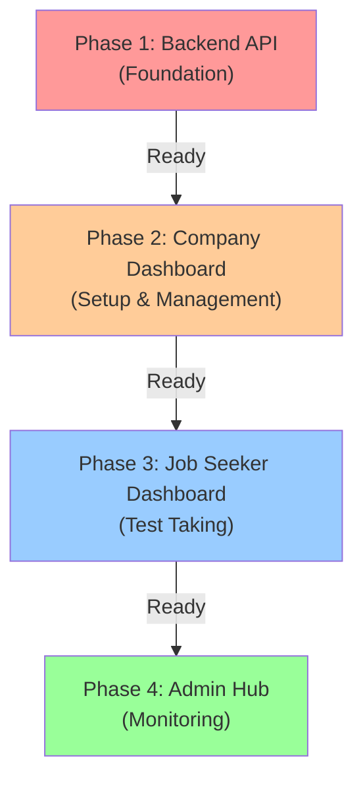

# 🎯 Interview Test Feature - Implementation Guide

**Created**: February 18, 2026  
**Status**: Planning & Architecture Phase  
**Priority**: High (Optional feature per job requirement)

---

## 📌 Overview

Fitur **Interview Test** adalah fitur tambahan opsional pada platform Karir Nusantara yang memungkinkan perusahaan untuk memberikan tes wawancara kepada calon pekerja sebelum mereka dipanggil untuk tahap wawancara tatap muka.

### Key Characteristics
- ✅ **Optional per job**: Setiap lowongan bisa memilih apakah memerlukan test atau tidak
- ✅ **Company-controlled**: Hanya perusahaan yang bisa setup test untuk lowongan mereka
- ✅ **Transparent timeline**: Semua test events tercatat di application timeline
- ✅ **Flexible test types**: Support multiple choice, essay, video, puzzle (future)
- ✅ **Scoring system**: Auto-grading untuk some question types

### Business Value
- Perusahaan: Filter kandidat berkualitas sebelum interview
- Job Seeker: Kesempatan menunjukkan skill sesuai job requirements
- Platform: Meningkatkan kualitas matching antara kandidat dan pekerjaan

---

## 🏗️ Architecture Overview

### System Diagram

```
┌──────────────────────────────────────────────────┐
│          KARIR NUSANTARA ECOSYSTEM               │
├──────────────────────────────────────────────────┤
│                                                  │
│  ┌─────────────────────────────────────────┐   │
│  │    Backend API (Go/Node.js)             │   │
│  │  - Interview Test Modules               │   │
│  │  - Question Bank Management             │   │
│  │  - Test Submission & Grading            │   │
│  │  - Timeline Events                      │   │
│  └─────────────────────────────────────────┘   │
│           ▲          ▲          ▲               │
│           │          │          │               │
│    ┌──────┴──┐  ┌────┴───┐  ┌──┴────────┐    │
│    │          │  │        │  │           │    │
│  ┌─▼───────┐ │┌─▼──────┐│┌─▼───────────┐│   │
│  │ Company ││││Job     │││Calon        ││   │
│  │Dashboard││ Seeker  │││Admin Hub    ││   │
│  │Setup    ││Dashboard││Monitoring    ││   │
│  │Test     ││Take Test││Analytics     ││   │
│  └────────┘ └─────────┘└────────────────┘   │
│                                              │
└──────────────────────────────────────────────┘
```

### Implementation Phases



---

## 📋 Phase 1: Backend API (Core Foundation)

**Duration**: 2-3 weeks  
**Priority**: CRITICAL - All other phases depend on this

### 1.1 Database Schema

#### New Tables Required

```sql
-- ============================================
-- Interview Tests Configuration
-- ============================================
CREATE TABLE job_interview_tests (
  id BIGINT PRIMARY KEY AUTO_INCREMENT,
  job_id BIGINT NOT NULL,
  company_id BIGINT NOT NULL,
  
  test_type ENUM(
    'multiple_choice',
    'essay',
    'short_answer',
    'video',
    'puzzle'
  ) DEFAULT 'multiple_choice',
  
  title VARCHAR(255) NOT NULL,
  description TEXT,
  instructions TEXT,
  
  time_limit_minutes INT DEFAULT 30,
  passing_score INT DEFAULT 70,
  max_attempts INT DEFAULT 1,
  show_score_immediately BOOLEAN DEFAULT true,
  
  enabled BOOLEAN DEFAULT true,
  archived_at TIMESTAMP NULL,
  
  created_at TIMESTAMP DEFAULT CURRENT_TIMESTAMP,
  updated_at TIMESTAMP DEFAULT CURRENT_TIMESTAMP ON UPDATE CURRENT_TIMESTAMP,
  
  FOREIGN KEY (job_id) REFERENCES jobs(id) ON DELETE CASCADE,
  FOREIGN KEY (company_id) REFERENCES companies(id) ON DELETE CASCADE,
  INDEX idx_job_id (job_id),
  INDEX idx_company_id (company_id),
  UNIQUE KEY unique_test_per_job (job_id)
) ENGINE=InnoDB;

-- ============================================
-- Interview Questions / Question Bank
-- ============================================
CREATE TABLE interview_questions (
  id BIGINT PRIMARY KEY AUTO_INCREMENT,
  test_id BIGINT NOT NULL,
  
  question_text TEXT NOT NULL,
  question_type ENUM(
    'multiple_choice',
    'essay',
    'short_answer',
    'video'
  ) NOT NULL,
  
  -- For multiple choice questions
  options JSON, -- [{id: "a", text: "Option A"}, ...]
  correct_answer VARCHAR(255), -- e.g., "a" untuk multiple choice
  
  -- For essay/short answer
  sample_answer TEXT,
  answer_guidelines TEXT,
  
  points INT DEFAULT 1,
  order_index INT NOT NULL,
  
  created_at TIMESTAMP DEFAULT CURRENT_TIMESTAMP,
  updated_at TIMESTAMP DEFAULT CURRENT_TIMESTAMP ON UPDATE CURRENT_TIMESTAMP,
  
  FOREIGN KEY (test_id) REFERENCES job_interview_tests(id) ON DELETE CASCADE,
  INDEX idx_test_id (test_id),
  INDEX idx_order (test_id, order_index)
) ENGINE=InnoDB;

-- ============================================
-- Test Submissions (Per Applicant)
-- ============================================
CREATE TABLE test_submissions (
  id BIGINT PRIMARY KEY AUTO_INCREMENT,
  application_id BIGINT NOT NULL UNIQUE,
  test_id BIGINT NOT NULL,
  
  attempt_number INT DEFAULT 1,
  status ENUM(
    'not_started',
    'in_progress',
    'submitted',
    'graded'
  ) DEFAULT 'not_started',
  
  started_at TIMESTAMP NULL,
  submitted_at TIMESTAMP NULL,
  graded_at TIMESTAMP NULL,
  
  time_spent_seconds INT DEFAULT 0,
  total_score INT DEFAULT 0,
  passing_score INT NOT NULL,
  is_passed BOOLEAN DEFAULT false,
  
  graded_by_type ENUM('system', 'manual', 'ai') DEFAULT 'system',
  graded_by_id BIGINT NULL,
  
  created_at TIMESTAMP DEFAULT CURRENT_TIMESTAMP,
  updated_at TIMESTAMP DEFAULT CURRENT_TIMESTAMP ON UPDATE CURRENT_TIMESTAMP,
  
  FOREIGN KEY (application_id) REFERENCES applications(id) ON DELETE CASCADE,
  FOREIGN KEY (test_id) REFERENCES job_interview_tests(id) ON DELETE CASCADE,
  INDEX idx_application_id (application_id),
  INDEX idx_test_id (test_id),
  INDEX idx_status (status)
) ENGINE=InnoDB;

-- ============================================
-- Individual Question Responses
-- ============================================
CREATE TABLE interview_test_responses (
  id BIGINT PRIMARY KEY AUTO_INCREMENT,
  submission_id BIGINT NOT NULL,
  question_id BIGINT NOT NULL,
  
  answer_text TEXT,
  answer_video_url VARCHAR(500), -- For video answers
  
  is_auto_graded BOOLEAN DEFAULT false,
  is_correct BOOLEAN DEFAULT NULL, -- NULL untuk essay (manual review)
  points_earned INT DEFAULT 0,
  max_points INT NOT NULL,
  
  grading_notes TEXT,
  graded_by_type ENUM('system', 'manual', 'ai'),
  graded_by_id BIGINT NULL,
  graded_at TIMESTAMP NULL,
  
  created_at TIMESTAMP DEFAULT CURRENT_TIMESTAMP,
  updated_at TIMESTAMP DEFAULT CURRENT_TIMESTAMP ON UPDATE CURRENT_TIMESTAMP,
  
  FOREIGN KEY (submission_id) REFERENCES test_submissions(id) ON DELETE CASCADE,
  FOREIGN KEY (question_id) REFERENCES interview_questions(id) ON DELETE CASCADE,
  INDEX idx_submission_id (submission_id),
  INDEX idx_question_id (question_id)
) ENGINE=InnoDB;
```

### 1.2 Module Structure

```
internal/modules/
├── interview_tests/
│   ├── entity.go              # Data models & constants
│   ├── repository.go          # Database operations
│   ├── service.go             # Business logic
│   ├── handler.go             # HTTP handlers
│   └── routes.go              # Route definitions
│
├── interview_questions/
│   ├── entity.go
│   ├── repository.go
│   ├── service.go
│   ├── handler.go
│   └── routes.go
│
├── test_submissions/
│   ├── entity.go
│   ├── repository.go
│   ├── service.go
│   ├── handler.go
│   └── routes.go
│
└── test_responses/
    ├── entity.go
    ├── repository.go
    ├── service.go
    ├── handler.go
    └── routes.go
```

### 1.3 Core Entities

```go
// entity.go in interview_tests module

package interview_tests

import (
  "database/sql"
  "time"
)

// Test Type Constants
const (
  TestTypeMultipleChoice = "multiple_choice"
  TestTypeEssay          = "essay"
  TestTypeShortAnswer    = "short_answer"
  TestTypeVideo          = "video"
  TestTypePuzzle         = "puzzle"
)

// InterviewTest represents a job's interview test configuration
type InterviewTest struct {
  ID                    uint64         `db:"id" json:"id"`
  JobID                 uint64         `db:"job_id" json:"job_id"`
  CompanyID             uint64         `db:"company_id" json:"company_id"`
  TestType              string         `db:"test_type" json:"test_type"`
  Title                 string         `db:"title" json:"title"`
  Description           sql.NullString `db:"description" json:"description,omitempty"`
  Instructions          sql.NullString `db:"instructions" json:"instructions,omitempty"`
  TimeLimitMinutes      int            `db:"time_limit_minutes" json:"time_limit_minutes"`
  PassingScore          int            `db:"passing_score" json:"passing_score"`
  MaxAttempts           int            `db:"max_attempts" json:"max_attempts"`
  ShowScoreImmediately  bool           `db:"show_score_immediately" json:"show_score_immediately"`
  Enabled               bool           `db:"enabled" json:"enabled"`
  CreatedAt             time.Time      `db:"created_at" json:"created_at"`
  UpdatedAt             time.Time      `db:"updated_at" json:"updated_at"`
}

// TestSubmission represents an applicant's test submission
type TestSubmission struct {
  ID            uint64    `db:"id" json:"id"`
  ApplicationID uint64    `db:"application_id" json:"application_id"`
  TestID        uint64    `db:"test_id" json:"test_id"`
  AttemptNumber int       `db:"attempt_number" json:"attempt_number"`
  Status        string    `db:"status" json:"status"` // not_started, in_progress, submitted, graded
  StartedAt     *time.Time `db:"started_at" json:"started_at,omitempty"`
  SubmittedAt   *time.Time `db:"submitted_at" json:"submitted_at,omitempty"`
  GradedAt      *time.Time `db:"graded_at" json:"graded_at,omitempty"`
  TimeSpentSeconds int    `db:"time_spent_seconds" json:"time_spent_seconds"`
  TotalScore    int       `db:"total_score" json:"total_score"`
  PassingScore  int       `db:"passing_score" json:"passing_score"`
  IsPassed      bool      `db:"is_passed" json:"is_passed"`
  CreatedAt     time.Time `db:"created_at" json:"created_at"`
  UpdatedAt     time.Time `db:"updated_at" json:"updated_at"`
}
```

### 1.4 Key API Endpoints

#### Company Operations (Protected)

```
# Setup/Manage Interview Test for a Job
POST   /api/jobs/:jobId/interview-tests
  - Create interview test configuration
  - Body: { test_type, title, description, time_limit_minutes, passing_score, max_attempts }
  - Auth: Company owner of the job
  - Returns: InterviewTest

PUT    /api/interview-tests/:testId
  - Update test configuration
  - Auth: Company owner
  - Returns: InterviewTest

DELETE /api/interview-tests/:testId
  - Archive/delete test
  - Auth: Company owner

# Question Management
POST   /api/interview-tests/:testId/questions
  - Add question to test
  - Body: { question_text, question_type, options, correct_answer, points, order_index }

PUT    /api/interview-questions/:questionId
  - Update question

DELETE /api/interview-questions/:questionId
  - Remove question

GET    /api/interview-tests/:testId/questions
  - List all questions in test

# View Test Results
GET    /api/applications/:appId/test-results
  - Get test submission details and responses
  - Auth: Company owner or applicant
  - Returns: TestSubmission + responses

GET    /api/jobs/:jobId/test-statistics
  - Get aggregated test stats for a job
  - Auth: Company owner
  - Returns: { total_taken, avg_score, pass_rate, completion_rate }
```

#### Applicant Operations (Protected)

```
# Take Test
GET    /api/applications/:appId/test-status
  - Check if applicant needs to take test
  - Returns: { requires_test, test_id, status, attempt_number, max_attempts }

POST   /api/applications/:appId/test-submission/start
  - Begin test (record started_at)
  - Returns: { submission_id, time_limit_minutes, questions }

POST   /api/applications/:appId/test-submission/save-answer
  - Save answer for a question (auto-save)
  - Body: { question_id, answer_text }
  - Returns: { success, saved_at }

POST   /api/applications/:appId/test-submission/submit
  - Submit completed test
  - Returns: { success, submission_id, total_score, is_passed }

GET    /api/applications/:appId/test-results
  - Get test results after submission
  - Returns: TestSubmission + responses (if show_score_immediately = true)
```

### 1.5 Service Layer Logic

**Key responsibilities:**
- ✅ Create intervals untuk test (validasi job exists, company ownership)
- ✅ Validate applicant eligibility (harus sudah melamar job)
- ✅ Auto-grade multiple choice questions
- ✅ Flag essay questions untuk manual review
- ✅ Calculate total score
- ✅ Determine pass/fail status
- ✅ Create timeline events (test_started, test_submitted, test_passed/failed)
- ✅ Send email notifications

### 1.6 Timeline Integration

Ketika test status berubah, tambahkan event ke `timeline_events` table di application:

```
Status: "test_required"
  → Ketika company setup test untuk job ini

Status: "test_started"
  → Ketika applicant mulai mengerjakan test

Status: "test_submitted"
  → Ketika applicant submit test

Status: "test_passed" / "test_failed"
  → Setelah test di-grade
  → Metadata: { score, passing_score, attempt_number }
```

### 1.7 Phase 1 Checklist

- [ ] Create database migrations for 4 new tables
- [ ] Implement interview_tests module (entity, repo, service, handler, routes)
- [ ] Implement interview_questions module
- [ ] Implement test_submissions module
- [ ] Implement test_responses module
- [ ] Auto-grading logic for multiple choice
- [ ] Score calculation & passing determination
- [ ] Permission checks (company ownership)
- [ ] Timeline event creation
- [ ] Email notifications (test required, results)
- [ ] API documentation
- [ ] Unit & integration tests
- [ ] Postman collection update

---

## 📋 Phase 2: Company Dashboard (Setup & Management)

**Duration**: 2 weeks  
**Depends on**: Phase 1 Backend API (MUST be ready)

### 2.1 New Pages & Components

```
src/
├── pages/
│   ├── dashboard/
│   │   ├── jobs/
│   │   │   ├── [jobId]/
│   │   │   │   └── interview-setup/
│   │   │   │       ├── InterviewSetupPage.tsx
│   │   │   │       └── components/
│   │   │   │
│   │   │   └── JobDetailsPage.tsx (enhanced with interview test section)
│   │   │
│   │   └── tests/
│   │       ├── TestsListPage.tsx
│   │       ├── TestResultsPage.tsx
│   │       └── CandidateTestScorePage.tsx
│   │
│   └── interview-test/
│       ├── CreateTestPage.tsx
│       ├── EditTestPage.tsx
│       └── TestPreviewPage.tsx
│
├── components/
│   ├── interview-test/
│   │   ├── TestSetupForm.tsx
│   │   ├── QuestionBuilder.tsx
│   │   ├── QuestionList.tsx
│   │   ├── TestSettings.tsx
│   │   ├── TestResults/
│   │   │   ├── TestResultsTable.tsx
│   │   │   ├── TestResultsChart.tsx
│   │   │   ├── IndividualResponseViewer.tsx
│   │   │   └── EssayGradingPanel.tsx
│   │   └── TestStatistics.tsx
│   │
│   └── job/
│       └── JobTestStatus.tsx (indicator component)
```

### 2.2 Key Features

#### Feature 1: Interview Test Setup Page

**URL**: `/dashboard/jobs/{jobId}/interview-setup`

**Components:**
- Test toggle switch ("Require interview test for this job")
- Test configuration form:
  - Test title & description
  - Test type dropdown
  - Time limit input
  - Passing score input
  - Max attempts input
  - Instructions textarea
  - Show score immediately checkbox

**Workflow:**
1. Company navigates to job detail
2. Clicks "Setup Interview Test"
3. Form to create/edit test config
4. Save → update database

```typescript
interface InterviewTestSetupFormProps {
  jobId: number;
  jobTitle: string;
  onSaved?: (test: InterviewTest) => void;
  onCancel?: () => void;
}

export function TestSetupForm(props: InterviewTestSetupFormProps) {
  // Form dengan React Hook Form + Zod validation
  // Fields: title, description, test_type, time_limit_minutes, 
  //         passing_score, max_attempts, instructions
}
```

#### Feature 2: Question Builder

**URL**: `/dashboard/tests/{testId}/questions`

**Components:**
- Question list with drag-to-reorder
- Add new question button
- Question item (edit/delete/preview)

**Question Creator Modal:**
- Question type selector
- Question text input
- Conditional fields based on type:
  - Multiple choice: Options editor
  - Essay: Sample answer + guidelines
  - Short answer: Correct answer pattern
- Points input
- Save button

```typescript
interface QuestionBuilderProps {
  testId: number;
  questions: InterviewQuestion[];
  onQuestionsChanged?: (questions: InterviewQuestion[]) => void;
}

// Question Editor Modal
interface QuestionEditorModalProps {
  question?: InterviewQuestion;
  testId: number;
  onSave: (question: InterviewQuestion) => void;
  onCancel: () => void;
}
```

#### Feature 3: Test Results Dashboard

**URL**: `/dashboard/jobs/{jobId}/test-results`

**Components:**
- Applicants list with test status:
  - Not started
  - In progress
  - Submitted
  - Passed
  - Failed

- Filters:
  - By status
  - By score range
  - Sort by submit date, score

- Results table columns:
  - Applicant name/email
  - Submitted date
  - Score & passing threshold
  - Pass/fail badge
  - Time spent
  - Actions (view details, manual grade essay)

- Individual result viewer:
  - All responses display
  - For MC: Show answer + correct answer + points
  - For essay: Show answer + sample answer + points awarded
  - Manual grading interface for essays

```typescript
interface TestResultsPageProps {
  jobId: number;
}

interface TestResultTableRowProps {
  result: TestSubmission;
  onViewDetails: (resultId: number) => void;
  onGradeEssay: (responseId: number) => void;
}

interface EssayGradingPanelProps {
  response: TestResponse;
  onGradingComplete: (points: number, notes: string) => void;
}
```

#### Feature 4: Test Statistics Widget

Embed dalam job detail page:
- Total applicants conducted test
- Average score
- Pass rate
- Completion rate (attempted / required)
- Test attempt distribution chart

### 2.3 Phase 2 Checklist

- [ ] Create interview test setup page
- [ ] Implement test configuration form
- [ ] Create question builder component
- [ ] Implement question reordering (drag and drop)
- [ ] Create test results listing page
- [ ] Implement results table with filters/sorting
- [ ] Create individual result viewer
- [ ] Implement essay grading interface
- [ ] Add test statistics widget
- [ ] Integrate with job detail page
- [ ] Add loading states & error handling
- [ ] Form validation
- [ ] API integration testing
- [ ] UI/UX testing

---

## 📋 Phase 3: Job Seeker Dashboard (Take Test)

**Duration**: 2 weeks  
**Depends on**: Phase 1 Backend API + Phase 2 Company Dashboard (conceptually)

### 3.1 New Pages & Components

```
src/
├── pages/
│   ├── applications/
│   │   ├── [appId]/
│   │   │   ├── TestPage.tsx (full page test taker)
│   │   │   └── TestResultsPage.tsx
│   │   │
│   │   └── ApplicationsPage.tsx (enhanced with test status)
│   │
├── components/
│   ├── interview-test/
│   │   ├── TestStartModal.tsx
│   │   ├── TestContainer.tsx (main test interface)
│   │   ├── QuestionRenderer.tsx (render questions by type)
│   │   ├── TestTimer.tsx (countdown timer)
│   │   ├── TestProgressBar.tsx
│   │   ├── TestResultsDisplay.tsx
│   │   └── TestAttemptHistory.tsx
│   │
│   └── applications/
│       ├── ApplicationCard.tsx (enhanced with test status badge)
│       └── ApplicationTimeline.tsx (integrated with test events)
```

### 3.2 Key Features

#### Feature 1: Test Status Notification

Dalam application card, tampilkan status test:
- `test_required`: Badge "Test Interview Diperlukan"
- `test_in_progress`: Badge "Sedang Mengerjakan Test"
- `test_passed`: Badge "Test Lulus ✓"
- `test_failed`: Badge "Test Tidak Lulus" (attempt info)

```typescript
interface TestStatusBadgeProps {
  status: 'not_started' | 'in_progress' | 'submitted' | 'passed' | 'failed';
  allowRetake?: boolean;
  score?: number;
  passingScore?: number;
}
```

#### Feature 2: Test Start Modal

Sebelum mulai test, tampilkan modal dengan informasi:
- Test title
- Time limit
- Number of questions
- Passing score
- Attempt number / max attempts
- Instructions
- Buttons: "Start Test" / "Cancel"

```typescript
interface TestStartModalProps {
  testInfo: InterviewTest;
  submissionStatus: TestSubmission;
  onStart: () => void;
  onCancel: () => void;
}
```

#### Feature 3: Test Player Interface

**Main features:**
- Full page test interface
- Left sidebar:
  - Question navigator (clickable question numbers)
  - Progress indicator
- Center area:
  - Current question display
  - Answer input area (varies by question type)
  - Next/Previous buttons
- Right sidebar:
  - Timer (countdown with warning)
  - Question progress (e.g., "3 of 20")
  - Help/instructions collapse

```typescript
interface TestContainerProps {
  submissionId: number;
  applicationId: number;
}

export function TestContainer(props: TestContainerProps) {
  const [currentQuestionIndex, setCurrentQuestionIndex] = useState(0);
  const [answers, setAnswers] = useState<Map<number, string>>();
  const [timeRemaining, setTimeRemaining] = useState(0);
  
  // Auto-save answers on change
  const saveAnswer = async (questionId: number, answer: string) => {
    await api.saveTestAnswer(submissionId, questionId, answer);
  };
}
```

#### Feature 4: Question Renderers (by type)

```typescript
interface QuestionRendererProps {
  question: InterviewQuestion;
  currentAnswer?: string;
  onAnswerChange: (answer: string) => void;
  disabled?: boolean;
}

// Multiple Choice
export function MultipleChoiceQuestion(props: QuestionRendererProps) {
  // Radio buttons atau buttons untuk setiap option
}

// Short Answer
export function ShortAnswerQuestion(props: QuestionRendererProps) {
  // Text input field
}

// Essay
export function EssayQuestion(props: QuestionRendererProps) {
  // Textarea dengan character count
}

// Video (future)
export function VideoQuestion(props: QuestionRendererProps) {
  // Video recorder component
}
```

#### Feature 5: Test Timer

Auto-submit functionality:
- Display remaining time
- Warn when time < 5 minutes
- Auto-submit when time = 0
- Store time spent in database

```typescript
interface TestTimerProps {
  durationMinutes: number;
  onTimeUp: () => void;
}
```

#### Feature 6: Test Results Display

Setelah submit, tampilkan:
- Total score / passing score
- Pass/fail status (jika show_score_immediately = true)
- Feedback per question (jika allowed)
- Attempt history (jika multiple attempts)

```typescript
interface TestResultsDisplayProps {
  submission: TestSubmission;
  responses: TestResponse[];
  canRetake?: boolean;
  onRetake?: () => void;
}
```

### 3.3 Phase 3 Checklist

- [ ] Add test status badge to application card
- [ ] Create test start modal
- [ ] Implement test container/player
- [ ] Create question renderers for each type
- [ ] Implement auto-save answer feature
- [ ] Create test timer component
- [ ] Implement progress indicator
- [ ] Create question navigator sidebar
- [ ] Implement test results display
- [ ] Add attempt history display
- [ ] Auto-submit when time up
- [ ] Handle network error recovery
- [ ] Timeline integration (test events appear in app timeline)
- [ ] Email notification when results ready
- [ ] Mobile responsive test interface
- [ ] Accessibility (keyboard navigation, screen reader support)

---

## 📋 Phase 4: Admin Hub (Monitoring & Analytics)

**Duration**: 1-2 weeks  
**Depends on**: Phase 1 Backend API (can be done after core features stable)

### 4.1 New Pages & Components

```
src/
├── pages/
│   ├── analytics/
│   │   ├── interview-tests/
│   │   │   ├── TestUsageStatsPage.tsx
│   │   │   ├── TestPerformanceAnalyticsPage.tsx
│   │   │   └── TestCompletionRatesPage.tsx
│   │   │
│   │   └── dashboard/
│   │       └── AdminDashboard.tsx (enhanced with test section)
│   │
├── components/
│   ├── admin/
│   │   ├── interview-test/
│   │   │   ├── TestUsageWidget.tsx
│   │   │   ├── TestPerformanceChart.tsx
│   │   │   ├── CompletionRateChart.tsx
│   │   │   ├── AverageScoresChart.tsx
│   │   │   └── TestAuditLog.tsx
```

### 4.2 Key Features

#### Feature 1: Test Usage Statistics

- Total tests created
- Active tests (enabled)
- Total test submissions
- Submission trend (chart over time)

#### Feature 2: Performance Analytics

- Average score across all tests
- Pass rate by job
- Score distribution (histogram)
- Test difficulty analysis

#### Feature 3: Completion Rates

- % of jobs with test enabled
- % of applications requiring test
- % of test completion (submitted/required)
- Completion time by job type

#### Feature 4: Audit Log

- Track test creation/modification
- Track company test activity
- Track applicant attempts
- For compliance & investigation

### 4.3 Phase 4 Checklist (Optional for MVP)

- [ ] Create admin test statistics page
- [ ] Implement usage widgets
- [ ] Create performance analytics charts
- [ ] Add completion rate dashboard
- [ ] Implement test audit log viewer
- [ ] Add filters & date range selection

---

## 🔄 API Response/Request Contracts

### Company Create Test Request

```json
{
  "test_type": "multiple_choice",
  "title": "Tes Skill Technical",
  "description": "Tes untuk menilai kemampuan technical candidates",
  "instructions": "Jawab 10 pertanyaan dalam waktu 30 menit",
  "time_limit_minutes": 30,
  "passing_score": 70,
  "max_attempts": 1,
  "show_score_immediately": true
}
```

### Company Create Question Request

```json
{
  "question_text": "Apa itu API?",
  "question_type": "multiple_choice",
  "options": [
    { "id": "a", "text": "Application Programming Interface" },
    { "id": "b", "text": "Application Program Interchange" },
    { "id": "c", "text": "Advanced Programming Interface" }
  ],
  "correct_answer": "a",
  "points": 1,
  "order_index": 1
}
```

### Applicant Start Test Request

```
POST /api/applications/{appId}/test-submission/start
Response:
{
  "submission_id": 123,
  "test_id": 456,
  "time_limit_minutes": 30,
  "questions": [
    {
      "id": 1,
      "question_text": "Apa itu API?",
      "question_type": "multiple_choice",
      "options": [...]
    },
    ...
  ]
}
```

### Applicant Submit Test Request

```
POST /api/applications/{appId}/test-submission/submit
Response:
{
  "success": true,
  "submission_id": 123,
  "total_score": 85,
  "passing_score": 70,
  "is_passed": true,
  "show_score_immediately": true,
  "results": {
    "responses": [
      {
        "question_id": 1,
        "answer": "a",
        "is_correct": true,
        "points_earned": 1,
        "max_points": 1
      }
    ]
  }
}
```

---

## 📊 Database Migration Example

```sql
-- migrations/020_create_interview_tests.sql

-- Drop existing tables if rolling back
-- (Usually handled by migration framework)

-- Create job_interview_tests table
CREATE TABLE IF NOT EXISTS job_interview_tests (
  id BIGINT PRIMARY KEY AUTO_INCREMENT,
  job_id BIGINT NOT NULL,
  company_id BIGINT NOT NULL,
  test_type ENUM('multiple_choice', 'essay', 'short_answer', 'video', 'puzzle') DEFAULT 'multiple_choice',
  title VARCHAR(255) NOT NULL,
  description TEXT,
  instructions TEXT,
  time_limit_minutes INT DEFAULT 30,
  passing_score INT DEFAULT 70,
  max_attempts INT DEFAULT 1,
  show_score_immediately BOOLEAN DEFAULT true,
  enabled BOOLEAN DEFAULT true,
  archived_at TIMESTAMP NULL,
  created_at TIMESTAMP DEFAULT CURRENT_TIMESTAMP,
  updated_at TIMESTAMP DEFAULT CURRENT_TIMESTAMP ON UPDATE CURRENT_TIMESTAMP,
  FOREIGN KEY (job_id) REFERENCES jobs(id) ON DELETE CASCADE,
  FOREIGN KEY (company_id) REFERENCES companies(id) ON DELETE CASCADE,
  UNIQUE KEY unique_test_per_job (job_id),
  INDEX idx_company_id (company_id),
  INDEX idx_enabled (enabled)
) ENGINE=InnoDB DEFAULT CHARSET=utf8mb4 COLLATE=utf8mb4_unicode_ci;

-- Create interview_questions table
CREATE TABLE IF NOT EXISTS interview_questions (
  id BIGINT PRIMARY KEY AUTO_INCREMENT,
  test_id BIGINT NOT NULL,
  question_text TEXT NOT NULL,
  question_type ENUM('multiple_choice', 'essay', 'short_answer', 'video') NOT NULL,
  options JSON,
  correct_answer VARCHAR(255),
  sample_answer TEXT,
  answer_guidelines TEXT,
  points INT DEFAULT 1,
  order_index INT NOT NULL,
  created_at TIMESTAMP DEFAULT CURRENT_TIMESTAMP,
  updated_at TIMESTAMP DEFAULT CURRENT_TIMESTAMP ON UPDATE CURRENT_TIMESTAMP,
  FOREIGN KEY (test_id) REFERENCES job_interview_tests(id) ON DELETE CASCADE,
  INDEX idx_test_id (test_id),
  INDEX idx_order (test_id, order_index)
) ENGINE=InnoDB DEFAULT CHARSET=utf8mb4 COLLATE=utf8mb4_unicode_ci;

-- Create test_submissions table
CREATE TABLE IF NOT EXISTS test_submissions (
  id BIGINT PRIMARY KEY AUTO_INCREMENT,
  application_id BIGINT NOT NULL UNIQUE,
  test_id BIGINT NOT NULL,
  attempt_number INT DEFAULT 1,
  status ENUM('not_started', 'in_progress', 'submitted', 'graded') DEFAULT 'not_started',
  started_at TIMESTAMP NULL,
  submitted_at TIMESTAMP NULL,
  graded_at TIMESTAMP NULL,
  time_spent_seconds INT DEFAULT 0,
  total_score INT DEFAULT 0,
  passing_score INT NOT NULL,
  is_passed BOOLEAN DEFAULT false,
  graded_by_type ENUM('system', 'manual', 'ai') DEFAULT 'system',
  graded_by_id BIGINT NULL,
  created_at TIMESTAMP DEFAULT CURRENT_TIMESTAMP,
  updated_at TIMESTAMP DEFAULT CURRENT_TIMESTAMP ON UPDATE CURRENT_TIMESTAMP,
  FOREIGN KEY (application_id) REFERENCES applications(id) ON DELETE CASCADE,
  FOREIGN KEY (test_id) REFERENCES job_interview_tests(id) ON DELETE CASCADE,
  INDEX idx_application_id (application_id),
  INDEX idx_test_id (test_id),
  INDEX idx_status (status)
) ENGINE=InnoDB DEFAULT CHARSET=utf8mb4 COLLATE=utf8mb4_unicode_ci;

-- Create interview_test_responses table
CREATE TABLE IF NOT EXISTS interview_test_responses (
  id BIGINT PRIMARY KEY AUTO_INCREMENT,
  submission_id BIGINT NOT NULL,
  question_id BIGINT NOT NULL,
  answer_text TEXT,
  answer_video_url VARCHAR(500),
  is_auto_graded BOOLEAN DEFAULT false,
  is_correct BOOLEAN DEFAULT NULL,
  points_earned INT DEFAULT 0,
  max_points INT NOT NULL,
  grading_notes TEXT,
  graded_by_type ENUM('system', 'manual', 'ai'),
  graded_by_id BIGINT NULL,
  graded_at TIMESTAMP NULL,
  created_at TIMESTAMP DEFAULT CURRENT_TIMESTAMP,
  updated_at TIMESTAMP DEFAULT CURRENT_TIMESTAMP ON UPDATE CURRENT_TIMESTAMP,
  FOREIGN KEY (submission_id) REFERENCES test_submissions(id) ON DELETE CASCADE,
  FOREIGN KEY (question_id) REFERENCES interview_questions(id) ON DELETE CASCADE,
  INDEX idx_submission_id (submission_id),
  INDEX idx_question_id (question_id),
  INDEX idx_is_auto_graded (is_auto_graded)
) ENGINE=InnoDB DEFAULT CHARSET=utf8mb4 COLLATE=utf8mb4_unicode_ci;
```

---

## 🚀 Implementation Priority & Dependencies

```
Must complete in this order:
1. Backend API (Phases 1) - 2-3 weeks
   ↓ (depends on)
2. Company Dashboard (Phase 2) - 2 weeks
   ↓ (parallel possible)
3. Job Seeker Dashboard (Phase 3) - 2 weeks
   ↓ (can be skipped for MVP)
4. Admin Hub (Phase 4) - 1-2 weeks (optional for MVP)

Total Timeline: 5-7 weeks for core features + 1-2 weeks for admin
```

---

## 📝 Notes for Future Development

- **Question Bank Reusability**: Pertimbangkan ability untuk reuse questions across jobs (Phase 2+)
- **Video Recording**: Video question type bisa di-add dalam Phase 2 development
- **Manual Grading Interface**: Essay grading perlu UI yang user-friendly untuk company HR
- **Auto-Grading AI**: Bisa di-implement setelah MVP stable (integration dengan AI service)
- **Test Analytics**: Admin dashboard bisa di-prioritize berdasarkan business needs
- **Multi-language Support**: Consider i18n untuk test content di future
- **A/B Testing**: Test difficulty validation bisa di-add untuk improve future tests
- **Plagiarism Detection**: Essay plagiarism checking bisa di-add later
- **Video Interview (Async)**: Bukan bagian dari ini, tapi related feature untuk future

---

## 🤝 Stakeholder Communication

### For Company Users
"Dengan fitur Interview Test, Anda dapat:
- Setup pertanyaan khusus untuk menilai skill calon karyawan
- Melihat score dan hasil test secara real-time
- Filter kandidat berkualitas sebelum wawancara langsung
- Hemat waktu HR dengan penilaian otomatis"

### For Job Seekers
"Jika perusahaan meminta tes interview:
- Anda akan mendapat notifikasi setelah melamar
- Kerjakan test dengan waktu yang fleksibel (sesuai deadline)
- Dapatkan score langsung setelah submit
- Ini kesempatan untuk menunjukkan skill Anda"

---

**Last Updated**: February 18, 2026  
**Version**: 1.0  
**Status**: Ready for Phase 1 Development
